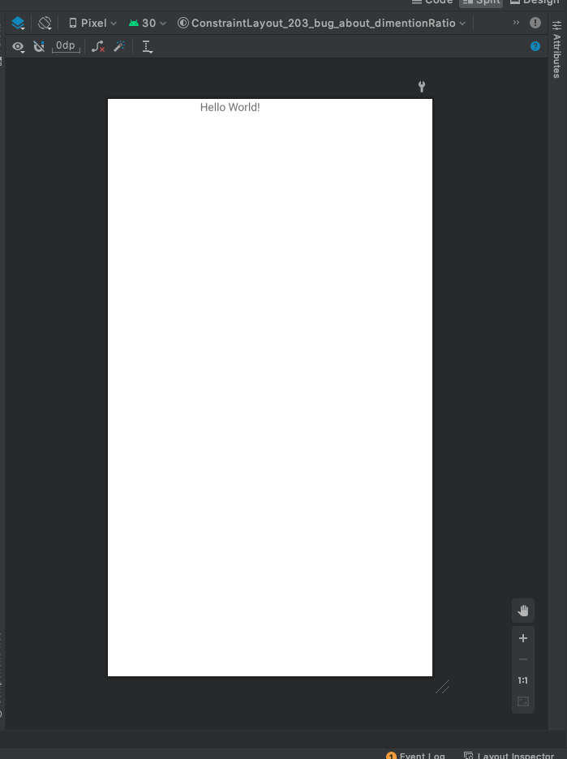
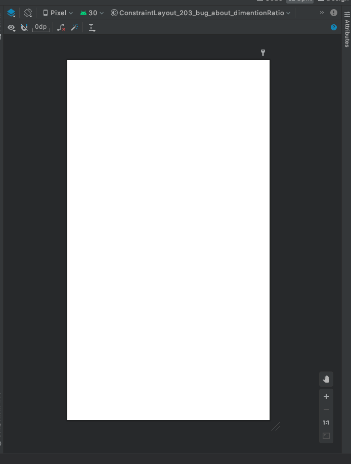

Sample project to verify reproducibility about a bug of ConstraintLayout 2.0.3
===

# Summary
ConstraintLayout 2.0.3 has a bug about `app:layout_constraintDimensionRatio`.
Child view of ConstraintLayout might be empty size in some case.

# Condition
1. Set "android:layout_width" or "android:layout_height" to "wrap_content"
2. Set "app:layout_constraintDimensionRatio" to a child view of ConstraintLayout
3. Set "0dp" to the child view of "android:layout_width" or "android:layout_height"
4. Set any fixed size (e.g. "100dp") to the child view of "android:layout_height" or "android:layout_width"

# Screenshots
On "2.0.2":

On "2.0.3":

